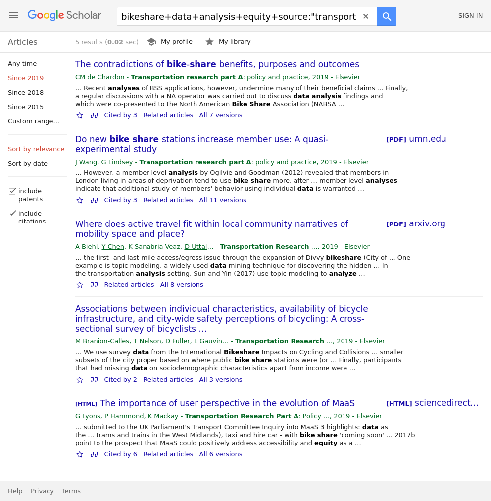

<!-- README.md is generated from README.Rmd. Please edit that file -->

# scholarsearch

<!-- badges: start -->

<!-- badges: end -->

``` r
remotes::install_github("robinlovelace/scholarsearch")
```

``` r
search_url = scholarsearch::scholarsearch(query = "bikeshare data analysis equity",
                                          source = "transportation research part A",
                                          as_ylo = 2019)
webshot::webshot(search_url)
```


